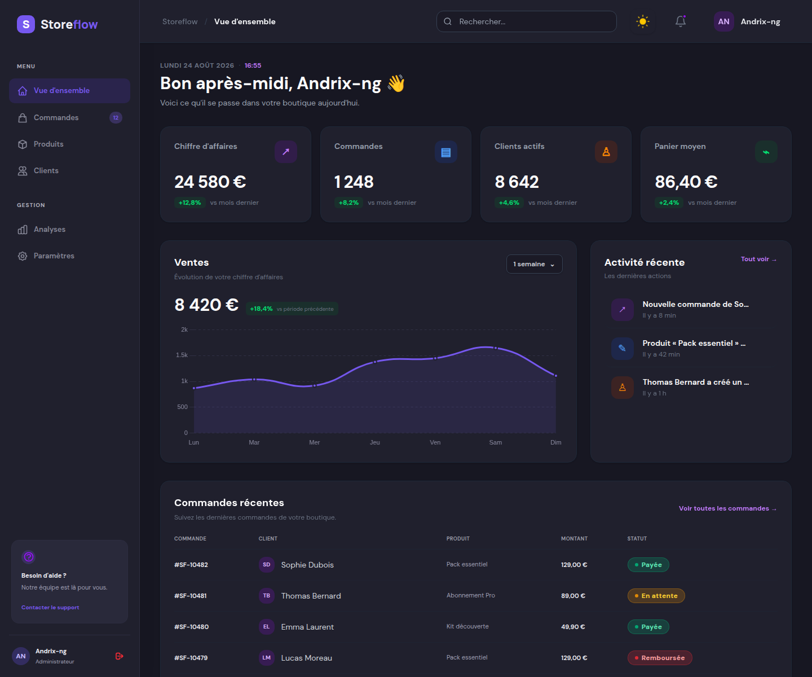

# Storeflow

Modern e-commerce dashboard built with Nuxt 4, Vue 3, TypeScript and Tailwind CSS.



## Features

- Overview dashboard with KPIs, recent activity, orders and animated charts.
- Product management with search, filters, statuses and pagination.
- Order management with search, filters, statuses and pagination.
- Customer management with 50 customers, search, filters, statuses and pagination.
- Analytics page with revenue trends, product/order comparisons and top customers.
- Settings page with profile management and configuration sections.
- Light and dark themes with system preference detection.
- Reusable components and strict TypeScript types.

## Getting started

```bash
pnpm install
pnpm dev
```

The application is available at `http://localhost:3000`.

## Scripts

```bash
pnpm dev       # start the development server
pnpm build     # create a production build
pnpm generate  # generate a static site
pnpm preview   # preview the production build
```

## Architecture

```text
app/
├── app.vue
├── assets/css/
│   ├── main.css              # Tailwind and global styles
│   └── theme.css             # light/dark theme and shared styles
├── components/
│   ├── analytics/             # KPIs, filters, charts and activity
│   ├── catalog/               # shared headers, summaries, toolbars and pagination
│   ├── customers/             # customer-specific table
│   ├── dashboard/             # overview dashboard widgets
│   ├── layout/                # shell and theme components
│   ├── orders/                # order-specific table
│   ├── products/              # product-specific table
│   ├── settings/              # settings navigation and forms
│   └── ui/                    # buttons, cards, badges and avatars
├── composables/
│   └── useAnalyticsData.ts    # analytics data and period selection
├── layouts/default.vue        # sidebar, top bar and navigation
├── pages/                     # application screens
└── types/                     # domain-specific TypeScript contracts
```

## Conventions

Pages orchestrate data and events. Shared behavior belongs in `components/catalog`, `components/ui` or `composables`. Tables remain domain-specific when their columns and actions differ. Local mock data keeps the prototype standalone and can later be replaced with composables connected to `server/api`.

## Tech stack

- [Nuxt 4](https://nuxt.com/)
- [Vue 3](https://vuejs.org/)
- [Tailwind CSS](https://tailwindcss.com/)
- [Chart.js](https://www.chartjs.org/) with `vue-chartjs`
- [`@nuxtjs/color-mode`](https://color-mode.nuxtjs.org/)
